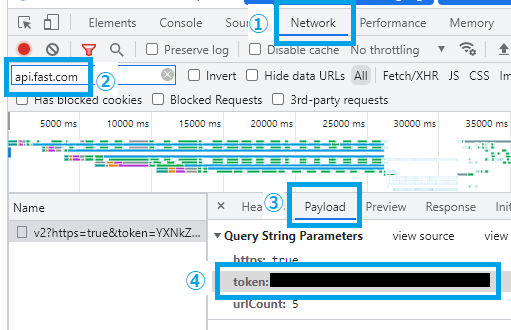

# Speed Logger

This tool uses fast.com API to periodically check and log network speed to CSV.

## Requirements

1. [nodejs](https://nodejs.org/ja/download/)

2. [fast.com API](https://github.com/branchard/fast-speedtest-api) command line tool

    `npm install --global fast-speedtest-api`

## How to use

1. Get token.

    1. Open fast.com with Chrome.
        In DevTools, open `Network` tab.

    2. Using filter, find request to `api.fast.com`.

        Reloading might help in case you don't see one.

    3. Open Payload tab.

    4. Copy the token.

    

2. Run the command below in Powershell.

    `.\speedtest.ps1 <token>`

    This will get response from fast.com API,
    wait 15 seconds, and call the API again.

3. The network speed will be logged in
    `./result/yyyyMMdd_hhmmss.csv`.

4. `Ctrl+C` to stop

## Parameters

`.\speedtest.ps1 <token> [-out <output file>] [-freq <interval between API calls (second)>]`
